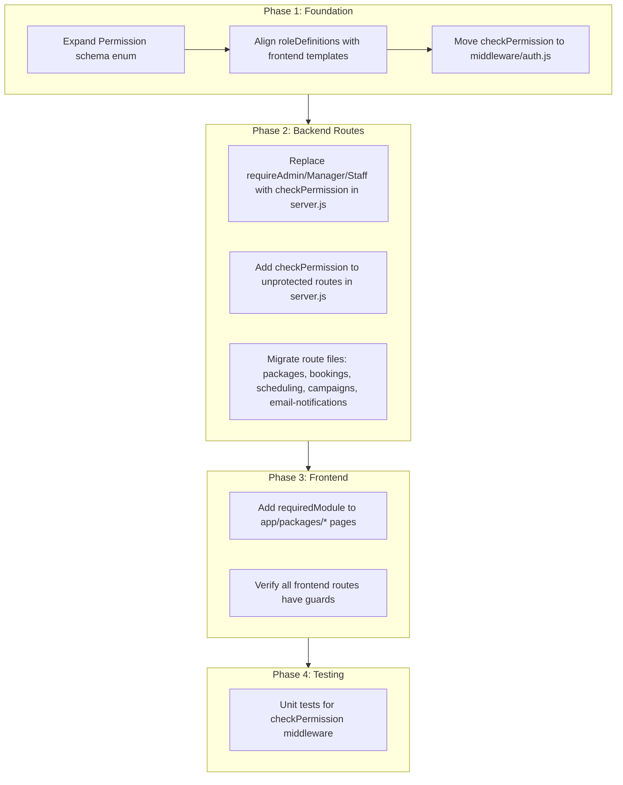

# Full RBAC Enforcement Plan

## Current State (Problems)

- **Backend `checkPermission` is only used on 8 routes** (lead_management) -- all other routes use coarse `requireAdmin`/`requireManager`/`requireStaff` that ignore the granular permissions set via the Staff Permissions UI
- **~40 routes have NO role/permission check** -- only `authenticateToken` (e.g. all appointments CRUD, cash registry, settings, receipts, bookings, individual client/staff/sale reads)
- **Permission.js schema enum is missing 11 modules** used by the frontend: `lead_management`, `campaigns`, `cash_registry`, `analytics`, `packages`, `business_settings`, `appointment_settings`, `currency_settings`, `tax_settings`, `notification_settings`, `plan_billing`
- **Backend `roleDefinitions`** diverge from frontend `buildRoleTemplate()` in [staff-permissions-modal.tsx](components/staff/staff-permissions-modal.tsx)
- `**checkPermission` is defined inline in server.js** instead of as a proper middleware export
- `**app/packages/`* pages** have no `ProtectedRoute`/`ProtectedLayout` with `requiredModule`

## Approach




## Phase 1: Permission Model + Middleware

### 1a. Update [backend/models/Permission.js](backend/models/Permission.js)

**Expand `module` enum** to include all modules from the frontend staff-permissions-modal:

```javascript
enum: [
  'dashboard', 'appointments', 'clients', 'membership', 'services',
  'products', 'staff', 'sales', 'reports', 'settings',
  'lead_management', 'campaigns', 'cash_registry', 'analytics', 'packages',
  'general_settings', 'business_settings', 'appointment_settings',
  'currency_settings', 'tax_settings', 'payment_settings', 'pos_settings',
  'notification_settings', 'plan_billing'
]
```

**Expand `feature` enum** to include granular report features:

```javascript
enum: ['view', 'create', 'edit', 'delete', 'manage', 'view_financial_reports', 'view_staff_commission']
```

**Update `roleDefinitions`** to match the frontend `buildRoleTemplate()` output exactly -- admin gets all modules, manager gets specific set (without `staff`, `payment_settings`, `pos_settings`, `plan_billing`), staff gets limited set.

### 1b. Move `checkPermission` to [backend/middleware/auth.js](backend/middleware/auth.js)

- Extract the `checkPermission` function from `server.js` (lines 427-460) into `auth.js`
- Export it alongside `authenticateToken`, `requireAdmin`, etc.
- Keep `requireAdmin`/`requireManager`/`requireStaff` exports for backward compat but they won't be used on routes
- Import `checkPermission` in `server.js` and all route files

## Phase 2: Backend Route Migration

### Module-to-Route Mapping

Every route gets `checkPermission(module, feature)` based on this mapping:

**Routes that remain auth-only (no permission check needed):**

- All `/api/auth/`* routes (login, logout, refresh, profile, forgot/reset password)
- `GET /api/business/plan`, `GET /api/business/info`, `GET /api/business/plans`
- Health endpoints, test endpoints, public receipt endpoint

`**dashboard` module:**

- `GET /api/reports/dashboard` -- view

`**appointments` module:**

- `GET /api/appointments` -- view
- `POST /api/appointments` -- create
- `GET /api/appointments/:id` -- view
- `PUT /api/appointments/:id` -- edit
- `DELETE /api/appointments/:id` -- delete
- `PATCH /:id/reschedule` (scheduling router) -- edit
- `PATCH /:id/cancel` (scheduling router) -- edit
- `GET/POST /api/block-time`, `PUT/DELETE /api/block-time/:id` -- manage
- Bookings router: POST / and holds -- create; GET /:id -- view

`**clients` module:**

- `GET /api/clients`, search, stats, `:id`, bulk-stats -- view
- `POST /api/clients`, import -- create
- `PUT /api/clients/:id` -- edit
- `DELETE /api/clients/:id` -- delete

`**services` module:**

- `GET /api/services` -- view
- `POST /api/services`, import -- create
- `PUT /api/services/:id`, PATCH tax-applicable -- edit
- `DELETE /api/services`, `DELETE /api/services/:id` -- delete

`**products` module:**

- `GET /api/products` -- view
- `POST /api/products`, import -- create
- `PUT /api/products/:id` -- edit
- `PATCH /api/products/:id/stock` -- edit
- `DELETE /api/products`, `DELETE /api/products/:id` -- delete
- All supplier, purchase-order, supplier-payable, category, inventory routes -- mapped to products with appropriate features

`**sales` module:**

- `GET /api/sales/`* -- view
- `POST /api/sales` -- create
- `POST /api/sales/:id/payment`, exchange -- create
- `PUT /api/sales/:id` -- edit
- `DELETE /api/sales/:id` -- delete
- Receipts: GET -- view, POST -- create
- Consumption rules/logs -- manage
- Expense routes -- mapped to sales (no separate module; GET/manage/create/edit/delete as appropriate)

`**staff` module:**

- `GET /api/staff`, staff-directory, `:id` -- view
- `POST /api/staff` -- create
- `PUT /api/staff/:id` -- edit
- `DELETE /api/staff/:id` -- delete
- Password changes, user management, permissions, GDPR -- manage
- Commission profiles -- manage (plus existing `requireFeature` gate)

`**reports` module:**

- `GET /api/reports/summary` -- view
- All `/api/reports/export/`* -- manage
- Specific report endpoints -- view
- Tip payouts -- manage

`**cash_registry` module:**

- `GET /api/cash-registry/`*, petty-cash-summary, logs -- view
- `POST /api/cash-registry`, petty-cash -- create
- `PUT`, `PATCH` -- edit
- `POST .../verify` -- manage
- `DELETE` -- delete

`**membership` module:**

- GET plans, subscriptions, customer membership -- view
- POST plans, subscribe -- create
- PUT/PATCH plans -- edit
- POST redeem -- create

`**lead_management` module:** Already uses checkPermission -- no change needed.

`**campaigns` module:**

- GET -- view
- POST -- create
- POST send -- manage
- PUT cancel -- edit

`**packages` module (in packages.js):**

- GET -- view
- POST create, sell -- create
- PUT, PATCH status -- edit
- DELETE -- delete
- Reports -- view
- Redeem/extend/reverse -- manage

**Settings modules:**

- `GET/PUT /api/settings/business` -- `business_settings.view/edit`
- `GET/PUT /api/settings/pos` -- `pos_settings.view/edit`
- `GET/PUT /api/settings/payment` -- `payment_settings.view/edit`
- Email notification routes -- `notification_settings.view/edit/manage`
- WhatsApp tenant routes -- `notification_settings.view/manage`

### Files to modify in Phase 2:

- **[backend/server.js](backend/server.js)** -- Replace all `requireAdmin`/`requireManager`/`requireStaff` with `checkPermission`, add `checkPermission` to unprotected routes (~100+ route changes)
- **[backend/routes/packages.js](backend/routes/packages.js)** -- Replace `requireManager` with `checkPermission('packages', ...)`
- **[backend/routes/bookings.js](backend/routes/bookings.js)** -- Add `checkPermission('appointments', ...)`
- **[backend/routes/appointments-scheduling.js](backend/routes/appointments-scheduling.js)** -- Add `checkPermission('appointments', 'edit')`
- **[backend/routes/campaigns.js](backend/routes/campaigns.js)** -- Add `checkPermission('campaigns', ...)`
- **[backend/routes/email-notifications.js](backend/routes/email-notifications.js)** -- Replace `requireAdminOrManager` with `checkPermission('notification_settings', ...)`

## Phase 3: Frontend Protection

### 3a. Add `requiredModule` to `app/packages/`* pages

Create a layout or wrap each page with `ProtectedLayout` using `requiredModule="packages"`:

- [app/packages/page.tsx](app/packages/page.tsx)
- [app/packages/new/page.tsx](app/packages/new/page.tsx)
- [app/packages/sell/page.tsx](app/packages/sell/page.tsx)
- [app/packages/reports/page.tsx](app/packages/reports/page.tsx)
- [app/packages/[id]/edit/page.tsx](app/packages/[id]/edit/page.tsx)

### 3b. Add `packages` module to Permission.js roleDefinitions

Ensure admin gets full access, manager gets full access, staff gets view-only for packages.

## Phase 4: Testing

- Write Jest tests for `checkPermission` middleware in `backend/tests/auth/check-permission.test.js`
- Test: admin bypasses all checks
- Test: non-admin without `hasLoginAccess` gets 403
- Test: user with matching permission passes
- Test: user without matching permission gets 403
- Test: missing module or feature returns 403

## Important Notes

- **Admin bypass preserved:** `checkPermission` already returns `next()` for `role === 'admin'`, so admin behavior is unchanged
- **Custom permissions honored:** Once coarse role checks are replaced, custom permissions set via the staff permissions UI will actually take effect
- **Behavioral change:** Some routes currently restricted to `requireAdmin` (e.g., `DELETE /api/clients/:id`) will now be accessible to managers/staff IF they have the corresponding permission enabled. This is intentional -- the permission UI already shows these as configurable
- **Platform admin routes untouched:** Routes in `admin.js`, `admin-settings.js`, `admin-plans.js`, `admin-access.js`, `admin-logs.js` use their own `authenticateAdmin`/`checkAdminPermission` system and are not affected
- `**user-permissions-dialog.tsx` left as-is:** This component uses different module IDs (`customers` vs `clients`, etc.) and is for main-DB User management. Since main-DB Users are typically admins (who bypass all checks), this is a cosmetic inconsistency, not a security gap. It can be unified in a future pass

